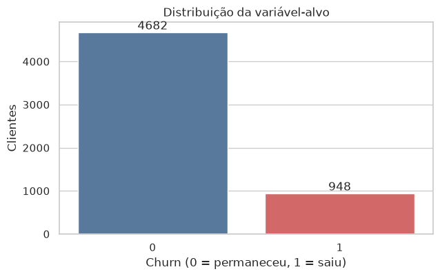
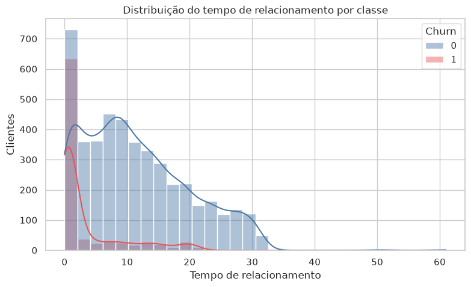
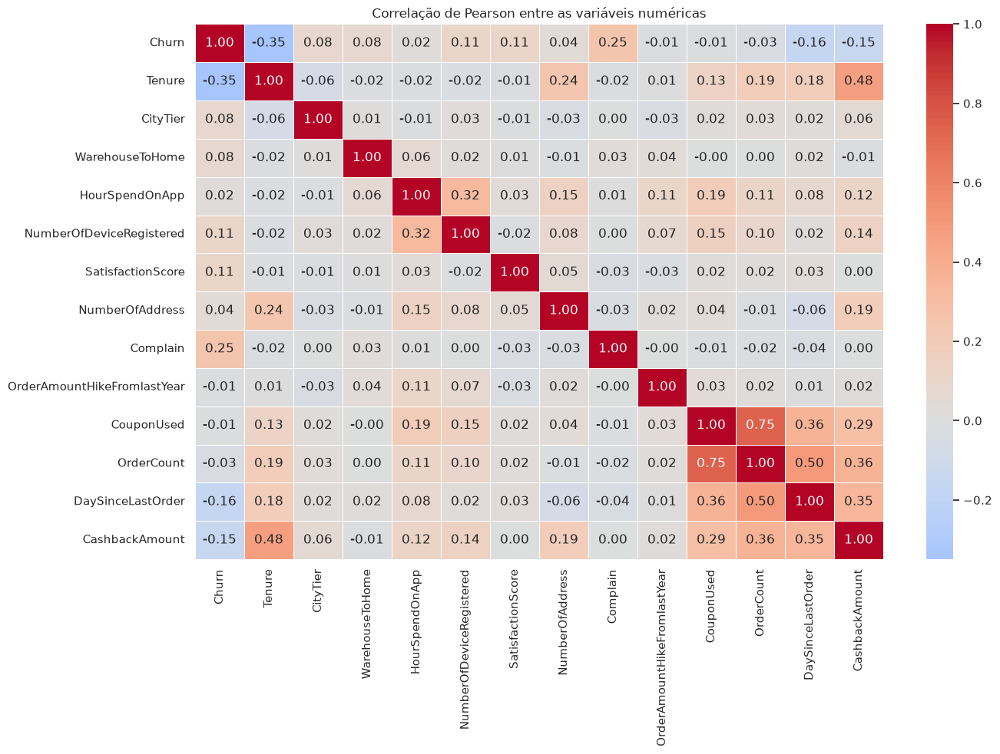
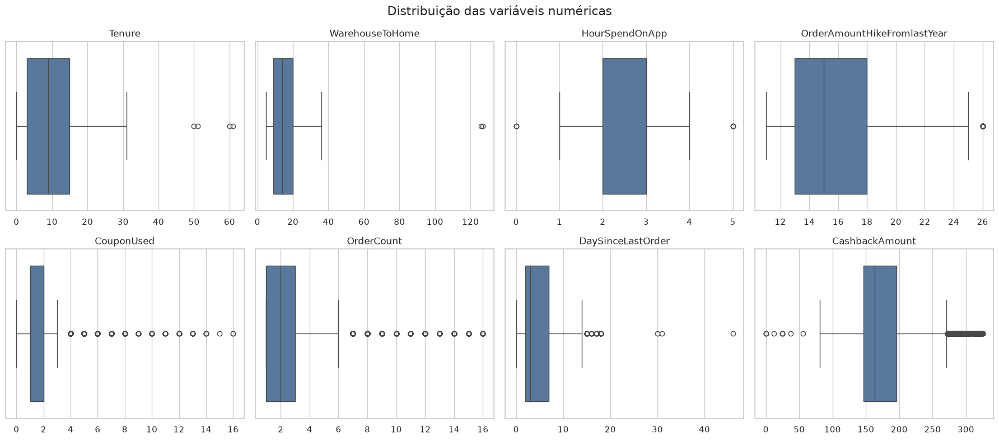
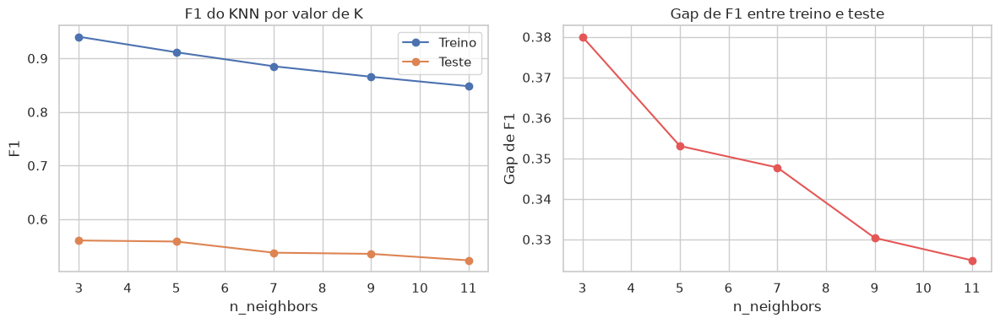
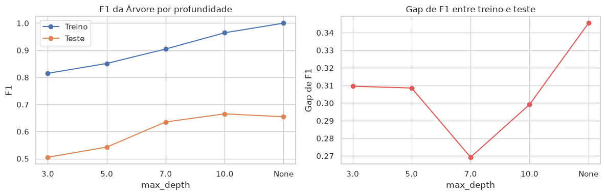
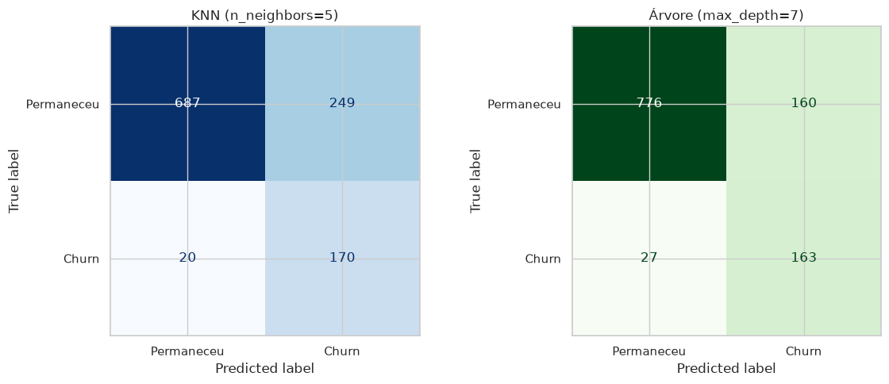

# Relatório para a diretoria: previsão de churn no e-commerce

Este documento resume o projeto de previsão de churn em linguagem direta, com os gráficos principais. Para o detalhe técnico completo (código, tratamento de dados, todas as decisões), veja o [notebook](../projeto_final.ipynb) e o [README](../README.md).

## O problema

A plataforma perde clientes sem aviso. Hoje não temos como saber, com antecedência, quem está prestes a sair, então não há como oferecer um cupom de retenção na hora certa.

Construímos um modelo que analisa o comportamento de cada cliente (tempo de casa, reclamações, forma de pagamento, cashback recebido, entre outras variáveis) e aponta quem tem maior risco de sair. A ideia é usar essa lista pra agir antes, não depois.

Dois erros são possíveis, e cada um tem um custo diferente:

- oferecer cupom pra quem já ia continuar comprando (custo pequeno, um cupom gasto à toa);
- não oferecer nada pra quem realmente ia sair (custo grande, o cliente é perdido de vez).

## O que os dados mostram

A base tem 5.630 clientes, e 16,84% deles saíram da plataforma no período analisado. É uma minoria, mas ainda assim relevante pro negócio.

O sinal mais forte encontrado foi o tempo de relacionamento com a plataforma. Quem sai costuma ser cliente há pouco tempo (mediana de 1 mês), enquanto quem fica costuma ter uma relação bem mais longa (mediana de 10 meses). Em outras palavras, o risco de perda é maior logo no começo da jornada do cliente.

Reclamação também pesa: clientes que reclamaram têm mais chance de sair depois. O mapa abaixo mostra como cada variável numérica da base se relaciona com as outras e com o churn.

Antes de treinar qualquer modelo, também olhamos se havia valores estranhos nos dados (números muito fora do padrão). Encontramos alguns, mas decidimos mantê-los: eles pareciam representar clientes de verdade com comportamento mais intenso (muitos pedidos, muitos cupons usados), não erro de cadastro.

## Como escolhemos o modelo

Testamos dois tipos de modelo, KNN e Árvore de Decisão, cada um com várias configurações diferentes. O cuidado principal foi evitar que o modelo simplesmente "decorasse" os clientes que já conhecia, sem conseguir prever nada sobre clientes novos.

Os gráficos abaixo mostram esse ajuste: a linha de treino sempre acerta mais, mas o que importa é a linha de teste (o que o modelo faz com dados que nunca viu). Escolhemos, em cada modelo, a configuração em que o teste se sai melhor sem abrir uma distância grande demais da linha de treino.

## Resultado final

Com as duas melhores configurações escolhidas, comparamos os dois modelos na mesma base de teste, a mesma que nenhum dos dois usou pra aprender.

- O **KNN** encontra 170 dos 190 clientes que realmente saíram, mas sinaliza 249 clientes que na verdade ficariam (cupom gasto à toa).
- A **Árvore de Decisão** encontra 163 desses clientes, um pouco menos, mas sinaliza só 160 clientes por engano, quase 90 cupons a menos desperdiçados.

Nenhum dos dois modelos é perfeito nas duas frentes ao mesmo tempo. A escolha depende do que custa mais caro pro negócio: perder um cliente ou gastar um cupom sem necessidade.

## Recomendação

Recomendamos colocar a **Árvore de Decisão** em um piloto controlado primeiro. Ela erra menos no total e desperdiça bem menos cupons, trocando isso por perder 7 clientes a mais em risco (de um total de 190) em comparação com o KNN.

Essa troca só vale a pena se o custo de perder um cliente não for muito maior que o custo de um cupom. Fizemos as contas: o KNN só passaria a valer mais a pena se perder um cliente custasse mais de ~12 vezes o valor de um cupom. Hoje não temos esse número real do negócio, então essa é a maior lacuna antes de decidir em definitivo.

## O que falta pra ir além do piloto

- O custo real de um cupom e o valor real de manter um cliente. Sem isso, a comparação entre os dois modelos fica no campo do "provavelmente", não do "com certeza".
- Acompanhamento do modelo em produção, pra ver se ele continua funcionando bem conforme o comportamento dos clientes muda com o tempo.
- Testar o modelo em levas novas de clientes, fora da base usada aqui.

---

## Sobre este relatório

A condução do projeto segue as seis fases do [CRISP-DM](https://en.wikipedia.org/wiki/Cross-industry_standard_process_for_data_mining), a metodologia mais usada em ciência de dados desde 1999. Problema de negócio, EDA, preparação, modelagem, avaliação e o piloto recomendado aqui correspondem, nessa ordem, às seis etapas do CRISP-DM.

A base usada é a [E Commerce Dataset](https://www.kaggle.com/datasets/ankitverma2010/ecommerce-customer-churn-analysis-and-prediction), publicada no Kaggle. O método de pagamento `UPI` presente na base indica que os dados provavelmente vêm de uma operação na Índia, não do Brasil nem dos Estados Unidos. Por isso este relatório evita converter qualquer valor da base pra reais, e trata comparações de custo (como a razão de ~12 citada acima) apenas como proporção, sem moeda associada.

Ferramentas usadas no processamento e na modelagem, nas versões instaladas no momento da execução: Python 3.13, pandas 3.0, scikit-learn 1.9, imbalanced-learn 0.14, matplotlib 3.11 e seaborn 0.13. As versões mínimas exigidas estão no [`requirements.txt`](../requirements.txt), e o código completo no [notebook](../projeto_final.ipynb) do projeto.
